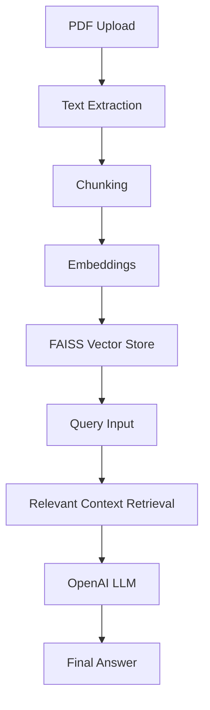

# 🧠 ContextIQ

### 🚀 AI Document Intelligence Assistant

<p align="center">


</p>

---

## 🌟 Overview

**ContextIQ** is an AI-powered document assistant that allows users to **chat with PDFs intelligently** using natural language.

Built using **Retrieval-Augmented Generation (RAG)**, it retrieves relevant context from documents and generates accurate responses using LLMs.

---

## ✨ Key Features

* 📄 Upload and process PDF documents
* 💬 Chat with your document (context-aware answers)
* 🧠 **Adaptive Response Modes**:

  * 🟢 **Beginner Mode** → Simple explanations
  * 🟡 **Exam Mode** → Structured answers
  * 🔴 **Strict Mode** → No hallucination (only from document)
* 📝 Generate exam-style questions
* 📌 Smart summarization
* ⚡ Fast semantic search using FAISS
* 🎯 Clean and interactive UI with Gradio

---

## 🧠 RAG Architecture (How it Works)



---

## 🛠️ Tech Stack

| Layer          | Technology            |
| -------------- | --------------------- |
| Language       | Python                |
| LLM            | OpenAI (GPT-4.1-mini) |
| Embeddings     | Sentence Transformers |
| Vector DB      | FAISS                 |
| UI             | Gradio                |
| PDF Processing | PyPDF                 |

---

## ⚙️ Installation

```bash
git clone https://github.com/your-username/contextiq.git
cd contextiq
pip install -r requirements.txt
```

---

## 🔑 Setup API Key

```bash
export OPENAI_API_KEY=your_api_key_here
```

---

## ▶️ Run the App

```bash
python app.py
```

---

## 🎥 Demo


```md

```

---

## 🎯 Learning & Takeaways

While building **ContextIQ**, I gained hands-on experience in:

* Designing scalable **Python functions for AI pipelines**
* Implementing **Retrieval-Augmented Generation (RAG)**
* Working with **vector embeddings and FAISS search**
* Integrating **LLMs into real-world applications**
* Building interactive AI apps using **Gradio**

---

## 🚀 Future Improvements

* 💬 Chat memory (conversation context)
* 🌐 Deploy as web application
* 📂 Multi-document support
* 🎨 Advanced UI/UX

---

## 📌 Notes

* Requires valid OpenAI API key with billing enabled
* Avoid exposing API keys publicly
* Works best with text-based PDFs

---

## 📊 Project Highlights

* 🔥 Built in a short development cycle (rapid prototyping)
* 🧠 Implements real-world AI architecture (RAG)
* 🎯 Focus on usability + accuracy

---

## 📄 License

MIT License

---

## 🙌 Acknowledgements

* OpenAI
* Hugging Face
* FAISS
* Gradio

---

<p align="center">
⭐ If you like this project, consider giving it a star!
</p>
